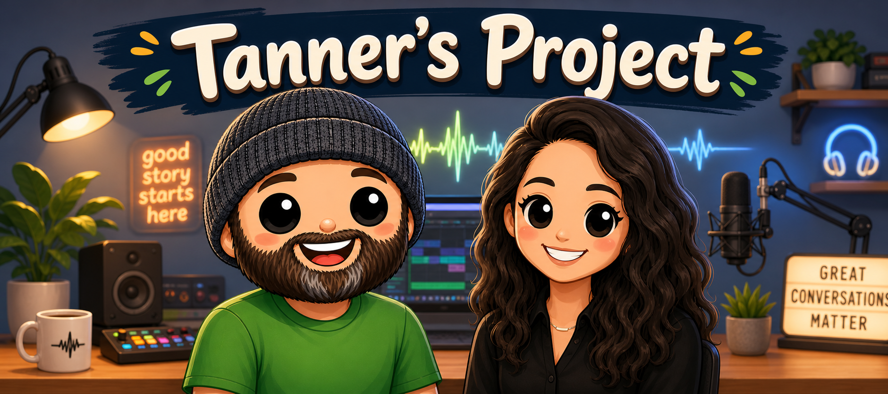

# 🎙️ Two-Voice Interview Generator

> Turn a timestamped two-speaker transcript into one MP3 that **sounds like the interview actually happened** — using ElevenLabs v3 with expressive `[laughs]`, `[whispers]`, `[curious]` audio tags.

```
INPUT (transcripts/sample.txt)              OUTPUT (out/sample.mp3)
─────────────────────────────────           ───────────────────────────
[00:00:00] Tanner: [excited] Welcome!  ──►  🔊 Voice A says it, excited
[00:00:04] Guest: [chuckles] Thanks!   ──►  🔊 Voice B chuckles, replies
[00:00:09] Tanner: [curious] So...     ──►  🔊 …stitched into one MP3
```

One command in. One MP3 out. No web UI, no manual stitching.

---

## 🎧 Hear it for yourself

Three samples generated from the same transcript ([`transcripts/cs-interview-example.txt`](./transcripts/cs-interview-example.txt) — a synthesized customer-success behavioral interview, ~2 minutes, two speakers with v3 expressive tags). Click to play in your browser:

| Sample | Mode | Model | Duration | Why it sounds the way it does |
| --- | --- | --- | --- | --- |
| 🟢 [**C — Segment + v4**](./samples/C-segment-v4.mp3) _(default, recommended)_ | segment | `eleven_v4` | 2:11 | Newest model, tighter pacing, expressive without needing dialogue mode |
| 🔵 [**A — Dialogue + v3**](./samples/A-dialogue-v3.mp3) | dialogue | `eleven_v3` | 2:32 | Whole conversation generated as one performance — real turn-taking, prosody match |
| ⚪ [**B — Segment + v3**](./samples/B-segment-v3.mp3) | segment | `eleven_v3` | 2:28 | Original v3 baseline, per-line stitched. Comparison reference. |

**Recommended listen order:** B → A → C. B is the baseline; A shows the dialogue-API upgrade; C shows what v4 does on top of segment-mode stitching.

> **Bottom line:** v4 in segment mode is the project's new default — it sounds confident and natural without needing v3 alpha access for the Dialogue API. Dialogue mode (v3) is still available with `--mode dialogue` and is the right pick when you want the model to "hear" both speakers in one pass.

---

## 📬 Hey Tanner — start here

This is the prototype Jake walked you through on the call. It's the **reenactment** half of your interviewer-training pipeline:

```
Your real interview MP4 + transcript
            │
            ▼
   [Step 1] PII sanitization ──► (your existing Claude skill)
            │
            ▼
   sanitized transcript with timestamps
            │
            ▼
   [Step 2] THIS PROJECT ─────► reenacted MP3 with two distinct voices
            │
            ▼
   Listenable training material — what good vs. bad interviews sound like
```

You don't need to read or write any code to use this. **`CLAUDE.md` in this repo is a script for Claude Code** — it tells Claude how to walk you through setup, ask you for the right things in the right order, and debug when something goes sideways. Just clone the repo, open Claude Code, and say _"hey, walk me through this."_

When you get stuck, tell Claude what you're seeing. It's been pre-briefed.

---

## 🗺️ Your path today

| Step | What you do | Time |
| --- | --- | --- |
| 1 | Install the prerequisites (Node, ffmpeg, Claude Code) | 5 min |
| 2 | Install the ElevenLabs skills with `npx skills add` | 2 min |
| 3 | Clone this repo and open it in Claude Code | 1 min |
| 4 | Tell Claude to walk you through it | 5 min |
| 5 | Listen to your first generated interview | 30 sec |

If anything in step 1 isn't installed, Claude will tell you what to run.

---

## 🧰 Prerequisites

| Tool | Check it's installed | If not… |
| --- | --- | --- |
| **Node.js 20+** | `node --version` | `brew install node` |
| **ffmpeg** | `ffmpeg -version` | `brew install ffmpeg` |
| **Claude Code** | `claude --version` | [docs.claude.com](https://docs.claude.com/en/docs/claude-code) |
| **GitHub CLI** _(optional)_ | `gh --version` | `brew install gh` |
| **ElevenLabs API key** | from [elevenlabs.io/app/settings/api-keys](https://elevenlabs.io/app/settings/api-keys) | make sure it has **TTS** + **Voices: read** scopes |

> 💡 **API key tip from the call:** for personal projects on your laptop, one open key is fine. For anything that ships, scope keys per-project. Jake's words.

---

## 1️⃣ Install the ElevenLabs skills

This is what plugs ElevenLabs into Claude Code — voice search, TTS, API key setup, all of it. You only do this **once** for your whole machine.

In your terminal (anywhere):

```bash
npx skills add https://github.com/elevenlabs/skills
```

A wizard pops up. Answer it like this:

| Prompt | Your answer | Why |
| --- | --- | --- |
| Which skills? | **Select ALL** _(spacebar to check, then Enter)_ | They're small, this project uses several |
| Coding agent? | **Claude Code** | That's what you're using |
| Scope? | **Global** | Available in every project, not just this one |
| Method? | **Symlink** | Auto-update when ElevenLabs ships changes |

After it finishes, **restart Claude Code** so it picks up the new skills.

> ✅ Verify it worked: in Claude Code, type `/text-to-speech` — it should appear as a skill suggestion.

---

## 2️⃣ Get the project

```bash
gh repo clone jakeat11labs/tannerproject
cd tannerproject
```

(Or click the green **Code** button on GitHub and download the zip.)

---

## 3️⃣ Let Claude drive (recommended)

Open the project in Claude Code:

```bash
claude
```

Then say something like:

> _"I just cloned this repo. Walk me through setting it up."_

Claude will:

1. Detect what's missing (API key, voice IDs, dependencies)
2. **Ask you for each piece**, one at a time
3. Run the script when you're ready
4. Open the MP3 for you when it's done

That's it. You don't need to touch the manual setup below unless you want to.

> 🎬 **Plan-mode tip from the call:** before Claude does anything big, hit **Shift+Tab** to flip into _plan mode_. It'll think, then show you a full plan before touching any files. You approve it, and only then does it run. This is how Jake set up the project in the first place — see [`CONVERSATION.md`](./CONVERSATION.md).

> ⏪ **Undo tip from the call:** hit **Esc Esc** (escape twice) to scroll through your previous messages. Click one and Claude will revert all its changes back to that point. Lifesaver when something goes sideways.

---

## 3️⃣ (alternative) Manual setup

If you'd rather drive yourself:

<details>
<summary><b>Click to expand manual steps</b></summary>

### Install dependencies

```bash
npm install
```

### Set your API key

Create `.env` in the project root:

```
ELEVENLABS_API_KEY=sk_your_key_here
```

`.env` is gitignored — it will never get committed.

### Pick two voices

Browse [elevenlabs.io/app/voice-library](https://elevenlabs.io/app/voice-library) and pick two voices that contrast nicely (one warm + one crisp, one masc + one fem, etc.). Click each voice → click the **ID** button to copy. IDs look like `21m00Tcm4TlvDq8ikWAM`.

### Configure speakers → voices

```bash
cp voices.config.example.json voices.config.json
```

Edit `voices.config.json`. **The keys must match the speaker names in your transcript exactly.**

```jsonc
{
  // Full form — control expressiveness per speaker
  "Tanner": {
    "voiceId": "21m00Tcm4TlvDq8ikWAM",
    "voiceSettings": {
      "stability": 0.4,        // 0.3 = expressive, 0.5 = balanced, 0.75+ = stable but ignores tags
      "similarityBoost": 0.75,
      "style": 0.4,
      "useSpeakerBoost": true
    }
  },
  // Short form — just the voice ID, defaults for everything else
  "Guest": "AZnzlk1XvdvUeBnXmlld"
}
```

### Drop in a transcript

Put a `.txt` file in `transcripts/` formatted as:

```
[00:00:00] Tanner: [excited] Welcome to the show!
[00:00:05] Guest: [chuckles] Thanks for having me.
```

A working sample is already there: `transcripts/sample.txt`.

### Generate

```bash
node src/index.js transcripts/sample.txt
# or
npm run generate -- transcripts/sample.txt
```

Output lands at `out/<filename>.mp3`. Open with `open out/sample.mp3`.

</details>

---

## 🧠 Two ways to generate audio (modes)

Three modes are available. The **default** is `auto` — it tries dialogue first and falls back to segment + v4 if your account can't use the dialogue API. **Both paths sound great**; pick based on the tradeoff you want.

| Mode | What it does | Default model | When to use |
| --- | --- | --- | --- |
| **`auto`** _(default)_ | Tries `dialogue` (v3) first, falls back to `segment` (v4) on access errors. | varies | Always. Just use this. |
| **`segment`** | Generates each speaker line individually via `/v1/text-to-speech`, then ffmpeg-concats with silence padding. Per-segment `voiceSettings` honored, finest-grained cache. | **`eleven_v4`** | The recommended path. Newest model, tighter pacing, no v3 alpha required. |
| **`dialogue`** | Sends each ≤1900-char chunk to `/v1/text-to-dialogue`. The v3 model generates the whole exchange as one coherent performance — real turn-taking and prosody matching across speakers. | `eleven_v3` _(endpoint requirement)_ | When you want the model to "hear" both speakers in one pass. Slightly slower iteration loop because the cache is per-chunk. |

```bash
# Default (auto) — recommended
node src/index.js transcripts/sample.txt

# Force segment + v4 (the default, explicit)
node src/index.js transcripts/sample.txt --mode segment

# Force dialogue mode (v3 only — endpoint requirement)
node src/index.js transcripts/sample.txt --mode dialogue

# Use a different model in segment mode
ELEVEN_MODEL_ID=eleven_v4_hq node src/index.js transcripts/sample.txt --mode segment
ELEVEN_MODEL_ID=eleven_v3    node src/index.js transcripts/sample.txt --mode segment

# Deterministic generation (same seed = same audio across runs)
node src/index.js transcripts/sample.txt --seed 42
```

**Choosing a model for segment mode** (override with `ELEVEN_MODEL_ID` env var):

| Model | Description | Default? |
| --- | --- | --- |
| **`eleven_v4`** | Newest expressive model. Tighter pacing, confident delivery, supports all v3 audio tags. | ✅ default |
| `eleven_v4_hq` | Higher-quality variant of v4. Slightly slower, similar audio quality in our testing. | |
| `eleven_v3` | The model the dialogue API uses. More leisurely pacing than v4. | |
| `eleven_multilingual_v2` | Pre-v3 model. Audio tags **not** supported (brackets get read aloud). Useful only as a last-resort fallback. | |

**About v3 alpha access:** the Dialogue API is v3-only. If your account can't use v3 yet, `auto` mode automatically falls back to segment + v4 (which is just as good for most uses). Request v3 access at https://help.elevenlabs.io/hc/en-us/articles/35869066075921 if you want dialogue mode.

**Audio polish (both modes):** Every generated clip runs through an ffmpeg polish pass — leading/trailing silence trimming, EBU R128 loudness normalization to -16 LUFS (podcast standard), output at 192 kbps stereo MP3. This eliminates segment-to-segment volume jumps and dead air between turns.

---

## 🎭 Writing expressive lines

The `[bracketed]` tags are how you direct delivery. Drop them right before (or right after) the line they affect.

| Want… | Use… |
| --- | --- |
| Laughter | `[laughs]` `[chuckles]` `[giggling]` |
| Whisper | `[whispers]` |
| Pause | `…` (ellipses) · `—` (em dash) · `[short pause]` · `[long pause]` |
| Emphasis | **CAPS** in the word: `It was a VERY long day.` |
| Curiosity | `[curious]` |
| Sad / reflective | `[sad]` `[crying]` `[sighs]` `[thoughtful]` |
| Excited | `[excited]` |
| Sarcasm | `[sarcastic]` |
| Accent | `[strong French accent]` `[strong British accent]` |

**Full reference:** **[`TAGS.md`](./TAGS.md)** — every official tag, the rules for combining them, and a vibe → tag-combo cheatsheet for interview moods.

> ⚠️ **Voice-dependent.** A meditative voice won't `[shout]` convincingly. A hyped voice won't `[whisper]` well. Pick voices whose training samples cover the emotional range you want.

> ⚠️ **v3 does NOT support `<break time="x.xs"/>`.** Use ellipses, em dashes, or `[short pause]` / `[long pause]` for pauses.

---

## 🧪 Testing tip from the call

When you generate a clip, **run it 3-4 times with the same script.** Each run will sound slightly different — different inflection, different pacing, occasionally a weird hallucination. This is normal for v3 expressive. Pick the take you like best.

Re-runs are cheap because of the cache (next section), but if you want to force a fresh take:

```bash
node src/index.js transcripts/your-file.txt --no-cache
```

You can also narrow this down: take a 30-min interview, cut it to a **2-minute test snippet**, and iterate on tags + voices on the snippet before generating the full thing.

---

## 💾 The cache (why re-runs are fast)

Every generated clip lives in `.cache/`. The cache splits by mode:

- **`.cache/segments/`** — segment mode: keyed by `voiceId + model + voiceSettings + text` (per line). Edit one line → only that line re-generates.
- **`.cache/dialogue/`** — dialogue mode: keyed by the entire chunk's inputs + voices + model + seed. Coarser-grained — editing one line within a chunk re-generates the whole chunk (~10-15 segments at once). Trade-off for the better naturalness.

| To… | Do this |
| --- | --- |
| See cache hits | Just run normally — it logs `(cache)` vs `(tts)` / `(api)` per item |
| Force regeneration of everything | `node src/index.js … --no-cache` |
| Get a different take of the same script | `--no-cache` (or use a different `--seed`) |
| Clear all caches | `rm -rf .cache` (it'll repopulate next run) |

---

## 🩹 Troubleshooting

<details>
<summary><b>"<code>ELEVENLABS_API_KEY is not set</code>"</b></summary>

`.env` is missing or doesn't have the key. Run `cat .env` to verify. If empty, recreate with `echo 'ELEVENLABS_API_KEY=sk_...' > .env`.

</details>

<details>
<summary><b>"<code>voice config not found at …</code>"</b></summary>

You haven't created `voices.config.json` yet. Run `cp voices.config.example.json voices.config.json` and edit it.

</details>

<details>
<summary><b>"<code>voice config missing valid voice IDs for: …</code>"</b></summary>

Either you still have `REPLACE_WITH_VOICE_ID` in your config, or the speaker name in the config doesn't match the speaker name in your transcript. **Names must match exactly — case-sensitive, including spaces.**

</details>

<details>
<summary><b>The output sounds robotic / no expression</b></summary>

- Drop `voiceSettings.stability` to `0.3` or `0.4`. Higher = more stable but **ignores tags**.
- Confirm you're on `eleven_v3`. The default in this project is v3 — but if you set `ELEVEN_MODEL_ID=eleven_multilingual_v2` somewhere, brackets get read as words.

</details>

<details>
<summary><b>The model reads <code>[brackets]</code> as words</b></summary>

You're not on `eleven_v3`. If your account has v3 alpha access, leave `ELEVEN_MODEL_ID` unset. If not, request access at [help.elevenlabs.io](https://help.elevenlabs.io/hc/en-us/articles/35869066075921). As a fallback, run with `ELEVEN_MODEL_ID=eleven_multilingual_v2` — works without v3 access but the tags won't render.

</details>

<details>
<summary><b>Voice ignoring tags even on v3</b></summary>

Stability is too high. Lower `voiceSettings.stability` for that speaker to ~0.3 and run with `--no-cache` (or `rm -rf .cache`).

</details>

<details>
<summary><b>"<code>ffmpeg: command not found</code>"</b></summary>

`brew install ffmpeg` (macOS) or your distro's equivalent.

</details>

<details>
<summary><b>"Dialogue mode unavailable" warning, falling back to segment</b></summary>

Your account doesn't have v3 alpha access yet. The script falls back automatically; audio still works but tags are less expressive. Request alpha access at https://help.elevenlabs.io/hc/en-us/articles/35869066075921 — usually approved within a few days. Or force segment mode anytime with `--mode segment`.

</details>

<details>
<summary><b>I want to compare dialogue vs segment side-by-side</b></summary>

```bash
node src/index.js transcripts/your-file.txt --mode dialogue -o out/dialogue.mp3
node src/index.js transcripts/your-file.txt --mode segment  -o out/segment.mp3
```

Listen to both. Dialogue should sound like one performance; segment should sound stitched together. The difference is most obvious on lines where one speaker reacts to the other (laughs, interruptions, tonal shifts).

</details>

---

## 🔬 Under the hood

Six modules. ~500 lines total. Read in this order:

```
transcripts/sample.txt
        │
        ▼
   src/parse.js  ────────►  segments: [{ speaker, text, ts }, …]
        │
        ├─── (mode: dialogue) ───►  src/dialogue.js
        │                           ├─ chunkSegments()  (≤1900 chars/chunk)
        │                           └─ POST /v1/text-to-dialogue per chunk
        │                              one polished MP3 per chunk
        │
        └─── (mode: segment)  ───►  src/tts.js
                                    one polished MP3 per speaker line
                                    via /v1/text-to-speech, cached by
                                    voice+model+settings+text hash
        │
        ▼ (every clip, both modes)
   src/polish.js  ────────►  silence trim + loudnorm -16 LUFS + 192k bitrate
        │
        ▼
   src/assemble.js  ──────►  ffmpeg concat with silence padding
        │                    (250ms same-speaker, 500ms switch in segment mode;
        │                     500ms between chunks in dialogue mode)
        ▼
   out/sample.mp3
```

Tying it all together: **`src/index.js`** (the CLI orchestrator with `--mode auto|dialogue|segment` and the auto-fallback logic).

For the deep dive on why dialogue mode beats segment mode, read **[`docs/RESEARCH-NATURAL-AUDIO.md`](./docs/RESEARCH-NATURAL-AUDIO.md)** — research on how other open-source multi-voice projects approach this.

---

## 📚 See exactly how this was built

This whole project went from "I have an idea" to "working tool" in one Claude Code session. Two docs let you replay it:

- **[`CONVERSATION.md`](./CONVERSATION.md)** — narrative version with lessons learned. **Start here.**
- **[`CONVERSATION-RAW.md`](./CONVERSATION-RAW.md)** — verbatim transcript of every prompt, every reply, every tool call. **Read this** when you want to see what an AI-driven dev session actually looks like end-to-end.
- **[`CLAUDE.md`](./CLAUDE.md)** — the instructions Claude Code reads when you open this repo. Includes a state-detection routine (deps? key? config? transcripts? ffmpeg?) and a troubleshooting playbook so the agent can drive your setup.
- **[`TAGS.md`](./TAGS.md)** — full ElevenLabs v3 audio-tag reference with a vibe → combo cheatsheet for interview moods.

---

## 📋 Quick command reference

```bash
# Setup (once)
npx skills add https://github.com/elevenlabs/skills          # install ElevenLabs skills globally
gh repo clone jakeat11labs/tannerproject && cd tannerproject # clone this repo
npm install                                                   # install deps
cp voices.config.example.json voices.config.json             # create your voice config
echo 'ELEVENLABS_API_KEY=sk_your_key' > .env                  # set your API key

# Generate
node src/index.js transcripts/sample.txt                     # default (auto mode)
node src/index.js transcripts/your-file.txt --mode dialogue  # force dialogue (most natural; needs v3 alpha)
node src/index.js transcripts/your-file.txt --mode segment   # force segment (no v3 alpha needed)
node src/index.js transcripts/your-file.txt -o foo.mp3       # custom output path
node src/index.js transcripts/your-file.txt --seed 42        # deterministic generation
node src/index.js transcripts/your-file.txt --no-cache       # force fresh take

# Listen
open out/sample.mp3
```

---

## 📜 License

MIT. Do whatever you want with it.

## 💛 Credits

Built collaboratively in a Claude Code session — see [`CONVERSATION.md`](./CONVERSATION.md) for the narrative and [`CONVERSATION-RAW.md`](./CONVERSATION-RAW.md) for the verbatim transcript.

For Tanner. You got this. 🎉
